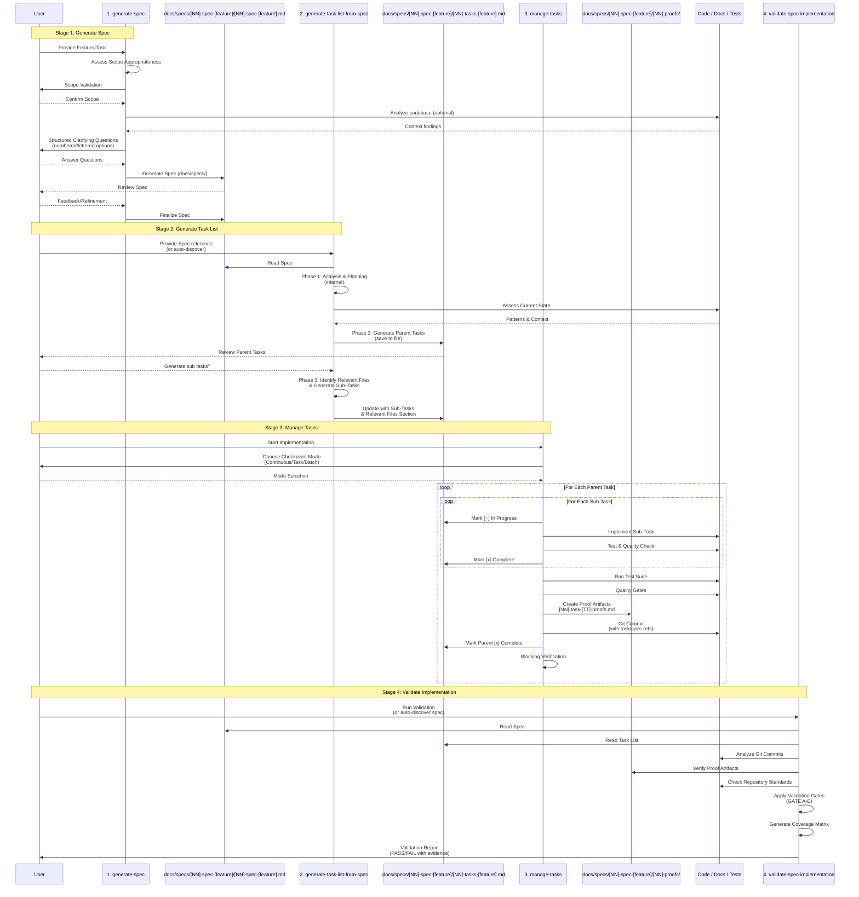

<div align="center">
    
    <h1>🧭 Spec-Driven Development Workflow</h1>
    <h3><em>Build predictable software with a repeatable AI-guided workflow.</em></h3>
</div>

<p align="center">
    <strong>Spec-driven development prompts for collaborating with AI agents to deliver reliable outcomes.</strong>
</p>

<p align="center">
    <a href="https://github.com/liatrio-labs/spec-driven-workflow/actions/workflows/ci.yml"></a>
    <a href="https://github.com/liatrio-labs/spec-driven-workflow/blob/main/LICENSE"></a>
    <a href="https://github.com/liatrio-labs/spec-driven-workflow/stargazers"></a>
</p>

## TLDR / Quickstart

**Want to install these prompts as slash commands?** Use the [slash-command-manager](https://github.com/liatrio-labs/slash-command-manager) utility to install them in all of your local AI tools:

```bash
uvx --from git+https://github.com/liatrio-labs/slash-command-manager \
  slash-man generate \
  --github-repo liatrio-labs/spec-driven-workflow \
  --github-branch main \
  --github-path prompts/
```

**Want to use the prompts directly?** Copy-paste them into your AI assistant:

1. **Generate a spec:** Copy `prompts/generate-spec.md` into your AI chat → AI assesses scope, asks structured questions (numbered/lettered options), optionally reviews codebase, generates spec, iterates with you → Spec saved to `docs/specs/01-spec-<feature-name>/01-spec-<feature-name>.md`

2. **Generate task list:** Point AI to spec (or let it auto-discover) and use `prompts/generate-task-list-from-spec.md` → AI analyzes spec, generates parent tasks for review, then after confirmation expands into sub-tasks with "Relevant Files" section → Saved to `docs/specs/01-spec-<feature-name>/01-tasks-<feature-name>.md`

3. **Manage tasks:** Use `prompts/manage-tasks.md` while implementing → Choose checkpoint mode (Continuous/Task/Batch), execute with verification checklists, create proof artifacts **before** commits → Proofs saved to `docs/specs/01-spec-<feature-name>/01-proofs/[NN]-task-[TT]-proofs.md`

4. **Validate:** Use `prompts/validate-spec-implementation.md` (or let it auto-discover) → AI verifies proof artifacts, applies validation gates, produces coverage matrix and validation report

5. **SHIP IT** 🚢💨

## Highlights

- **Prompt-first workflow:** Use curated prompts to go from idea → spec → task list → implementation-ready backlog.
- **Predictable delivery:** Every step emphasizes demoable slices, proof artifacts, and collaboration with junior developers in mind.
- **No dependencies required:** The prompts are plain Markdown files that work with any AI assistant.

## Why Spec-Driven Development?

Spec-Driven Development (SDD) keeps AI collaborators and human developers aligned around a shared source of truth. This repository provides a lightweight, prompt-centric workflow that turns an idea into a reviewed specification, an actionable plan, and a disciplined execution loop. By centering on markdown artifacts instead of tooling, the workflow travels with you—across projects, models, and collaboration environments.

## Guiding Principles

- **Clarify intent before delivery:** The spec prompt enforces clarifying questions so requirements are explicit and junior-friendly.
- **Ship demoable slices:** Every stage pushes toward thin, end-to-end increments with clear demo criteria and proof artifacts.
- **Make work transparent:** Tasks live in versioned markdown files so stakeholders can review, comment, and adjust scope anytime.
- **Progress one slice at a time:** The management prompt enforces single-threaded execution to reduce churn and unfinished work-in-progress.
- **Stay automation ready:** While SDD works with plain Markdown, the prompts are structured for MCP, IDE agents, or other AI integrations.

## Prompt Workflow

All prompts live in `prompts/` and are designed for use inside your preferred AI assistant.

1. **`generate-spec`** (`prompts/generate-spec.md`): Assess scope appropriateness, ask structured clarifying questions with numbered/lettered options, optionally review codebase context, then author a junior-friendly spec with demoable slices. Includes review and refinement cycle.
2. **`generate-task-list-from-spec`** (`prompts/generate-task-list-from-spec.md`): Three-phase process: (1) internal analysis and planning, (2) generate parent tasks for review, (3) after user confirmation, expand into sub-tasks with relevant files section. Auto-discovers spec if not provided.
3. **`manage-tasks`** (`prompts/manage-tasks.md`): Coordinate execution with checkpoint modes (Continuous/Task/Batch), update task status, create proof artifacts before commits, follow structured verification checklists, and record outcomes as you deliver value.
4. **`validate-spec-implementation`** (`prompts/validate-spec-implementation.md`): Auto-discovers spec if needed, validates implementation against spec using proof artifacts, applies validation gates, produces coverage matrix, and generates comprehensive validation report.

Each prompt writes Markdown outputs into `docs/specs/[NN]-spec-[feature-name]/` (where `[NN]` is a zero-padded 2-digit number: 01, 02, 03, etc.), giving you a lightweight backlog that is easy to review, share, and implement.

## How does it work?

The workflow is driven by Markdown prompts that function as reusable playbooks for the AI agent. Reference the prompts directly, or install them as slash commands using the [slash-command-manager](https://github.com/liatrio-labs/slash-command-manager), to keep the AI focused on structured outcomes.

**📚 For comprehensive documentation, examples, and detailed guides, visit the [SDD Playbook on GitHub Pages](https://liatrio-labs.github.io/spec-driven-workflow/):**

- **[SDD Playbook](https://liatrio-labs.github.io/spec-driven-workflow/)** — Complete overview and workflow guide
- **[Comparison](https://liatrio-labs.github.io/spec-driven-workflow/comparison.html)** — How SDD compares to other structured development tools
- **[Developer Experience](https://liatrio-labs.github.io/spec-driven-workflow/developer-experience.html)** — Real-world usage examples and patterns
- **[Common Questions](https://liatrio-labs.github.io/spec-driven-workflow/common-questions.html)** — FAQ and troubleshooting
- **[Video Overview](https://liatrio-labs.github.io/spec-driven-workflow/video-overview.html)** — Visual walkthrough of the workflow
- **[Reference Materials](https://liatrio-labs.github.io/spec-driven-workflow/reference-materials.html)** — Additional resources and examples

## Workflow Overview

Four prompts in `/prompts` define the full lifecycle. Use them sequentially to move from concept to completed work.

### Stage 1 — Generate the Spec ([prompts/generate-spec.md](./prompts/generate-spec.md))

- **Initial Scope Assessment**: Evaluates if the feature is appropriately sized for this workflow (not too large or too small).
- **Clarifying Questions**: Asks structured questions with numbered/lettered options to gather detailed requirements, focusing on "what" and "why" rather than "how."
- **Context Assessment** (optional): Reviews existing codebase for relevant patterns, constraints, and repository standards.
- **Spec Generation**: Creates a comprehensive specification document with goals, user stories, demoable units, functional requirements, non-goals, design considerations, repository standards, technical considerations, success metrics, and open questions.
- **Review and Refinement**: Validates completeness and clarity with the user, iterating based on feedback.
- Produces `docs/specs/[NN]-spec-[feature-name]/[NN]-spec-[feature-name].md` (where `[NN]` is a zero-padded 2-digit number: 01, 02, 03, etc.).

### Stage 2 — Generate the Task List ([prompts/generate-task-list-from-spec.md](./prompts/generate-task-list-from-spec.md))

- **Phase 1: Analysis and Planning** (internal): Receives spec reference (or auto-discovers oldest spec without tasks), analyzes requirements, assesses current codebase state, defines demoable units, and evaluates scope.
- **Phase 2: Parent Task Generation**: Creates high-level parent tasks (typically 4-6) representing demoable units of work, each with demo criteria and proof artifacts. Saves to task file and presents for user review.
- **Phase 3: Sub-Task Generation** (after user confirmation): Identifies relevant files, breaks down each parent task into actionable sub-tasks, and updates the task file with complete structure including "Relevant Files" section.
- Outputs `docs/specs/[NN]-spec-[feature-name]/[NN]-tasks-[feature-name].md` ready for implementation.

### Stage 3 — Manage Tasks ([prompts/manage-tasks.md](./prompts/manage-tasks.md))

- **Checkpoint Modes**: Presents three execution modes (Continuous/Task/Batch) for user preference, defaulting to Task Mode.
- **Structured Execution**: Follows a workflow with verification checkpoints:
  - Sub-task execution: Mark in-progress → Implement → Test → Quality check → Mark complete
  - Parent task completion: Run test suite → Quality gates → Create proof artifacts → Verify demo criteria → Git commit → Mark complete
- **Proof Artifacts**: Creates a single markdown file per parent task in `docs/specs/[NN]-spec-[feature-name]/[NN]-proofs/[NN]-task-[TT]-proofs.md` **before** the commit, containing CLI output, test results, screenshots, configuration examples, and demo validation.
- **Git Workflow**: One commit per parent task with conventional commit format including task and spec references. Includes blocking verification before proceeding to next task.
- Enforces disciplined execution with built-in verification checklists and progress tracking.

### Stage 4 — Validate Implementation ([prompts/validate-spec-implementation.md](./prompts/validate-spec-implementation.md))

- **Auto-Discovery**: If no spec is provided, automatically discovers the most recent spec with incomplete tasks by scanning `docs/specs/` directory.
- **Validation Process**:
  - Maps git commits to requirements and tasks
  - Analyzes changed files against "Relevant Files" list
  - Verifies proof artifacts (URLs, CLI commands, tests, screenshots)
  - Checks repository standards compliance
- **Validation Gates**: Applies mandatory gates (GATE A-E) including critical/high issue blocking, coverage matrix completeness, proof artifact accessibility, file integrity, and repository compliance.
- **Coverage Matrix**: Produces evidence-based coverage tables for Functional Requirements, Repository Standards, and Proof Artifacts with Verified/Failed/Unknown status.
- **Output**: Generates a single human-readable Markdown validation report with executive summary, coverage matrix, issues with severity ratings, and evidence appendix.
- Validates completeness, correctness, and adherence to the original specification.

### Detailed SDD Workflow Diagram



## Core Artifacts

- **Specs:** `docs/specs/[NN]-spec-[feature-name]/[NN]-spec-[feature-name].md` — canonical requirements including goals, user stories, demoable units, functional requirements, non-goals, design considerations, repository standards, technical considerations, success metrics, and open questions (where `[NN]` is a zero-padded 2-digit number: 01, 02, 03, etc.).
- **Task Lists:** `docs/specs/[NN]-spec-[feature-name]/[NN]-tasks-[feature-name].md` — parent/subtask checklist with demo criteria, proof artifacts, and "Relevant Files" section listing all files that will be created or modified.
- **Proof Artifacts:** `docs/specs/[NN]-spec-[feature-name]/[NN]-proofs/[NN]-task-[TT]-proofs.md` — single markdown file per parent task (created before commit) containing CLI output, test results, screenshots, configuration examples, and demo validation evidence (where `[NN]` is spec number and `[TT]` is task number).
- **Status Keys:** `[ ]` not started, `[~]` in progress, `[x]` complete, mirroring the manage-tasks guidance.
- **Validation Reports:** Generated by the validation prompt, includes coverage matrix, validation gates status, and evidence-based verification results.

## Usage Options

### Option 1: Manual Copy-Paste (No Tooling Required)

1. **Kick off a spec:** Copy or reference `prompts/generate-spec.md` inside your preferred AI chat. The AI will assess scope appropriateness, ask structured clarifying questions (with numbered/lettered options), optionally review your codebase, generate the spec, and iterate with you until it's complete. The spec is saved to `docs/specs/[NN]-spec-[feature-name]/[NN]-spec-[feature-name].md`.
2. **Plan the work:** Point the assistant to the new spec (or let it auto-discover) and walk through `prompts/generate-task-list-from-spec.md`. The AI will analyze the spec, generate parent tasks for your review (Phase 2), then after you confirm, expand into detailed subtasks with a "Relevant Files" section (Phase 3). The result is saved to `docs/specs/[NN]-spec-[feature-name]/[NN]-tasks-[feature-name].md`.
3. **Execute with discipline:** Follow `prompts/manage-tasks.md` while implementing. Choose your checkpoint mode (Continuous/Task/Batch), update statuses as you work, create proof artifacts in `docs/specs/[NN]-spec-[feature-name]/[NN]-proofs/[NN]-task-[TT]-proofs.md` **before** each commit, and follow the verification checklists at each step.
4. **Validate:** Use `prompts/validate-spec-implementation.md` (or let it auto-discover the spec) to ensure the implementation matches the spec. The AI will verify proof artifacts, check coverage, apply validation gates, and produce a comprehensive validation report.

### Option 2: Native Slash Commands (Recommended)

Install the prompts as native slash commands in your AI assistant using the [slash-command-manager](https://github.com/liatrio-labs/slash-command-manager):

```bash
uvx --from git+https://github.com/liatrio-labs/slash-command-manager \
  slash-man generate \
  --github-repo liatrio-labs/spec-driven-workflow \
  --github-branch main \
  --github-path prompts/
```

This will auto-detect your configured AI assistants (Claude Code, Cursor, Windsurf, etc.) and install the prompts as slash commands.

Once installed, you can use:

- `/generate-spec` - Generate a new specification
- `/generate-task-list-from-spec` - Create a task list from a spec
- `/manage-tasks` - Manage task execution
- `/validate-spec-implementation` - Validate implementation against spec

## Installation

```bash
# Clone the repository
git clone https://github.com/liatrio-labs/spec-driven-workflow.git
cd spec-driven-workflow
```

That's it! The prompts are plain Markdown files in the `prompts/` directory. No dependencies required.

## References

| Reference | Description | Link |
| --- | --- | --- |
| AI Dev Tasks | Foundational example of an SDD workflow expressed entirely in Markdown. | <https://github.com/snarktank/ai-dev-tasks> |
| Slash Command Manager | Utility for installing prompts as slash commands in AI assistants. | <https://github.com/liatrio-labs/slash-command-manager> |
| MCP | Standard protocol for AI agent interoperability. | <https://modelcontextprotocol.io/docs/getting-started/intro> |

## License

This project is licensed under the Apache License, Version 2.0. See the [LICENSE](LICENSE) file for details.
