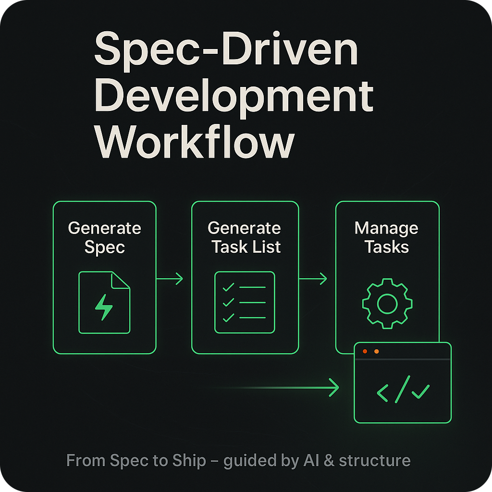
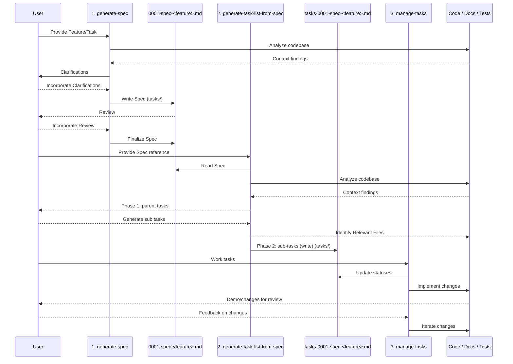

<div align="center">
    
    <h1>🧭 Spec-Driven Development Workflow</h1>
    <h3><em>Build predictable software with a repeatable AI-guided workflow.</em></h3>
</div>

<p align="center">
    <strong>Spec-driven development prompts for collaborating with AI agents to deliver reliable outcomes.</strong>
</p>

<p align="center">
    <a href="https://github.com/liatrio-labs/spec-driven-workflow/actions/workflows/ci.yml"></a>
    <a href="https://github.com/liatrio-labs/spec-driven-workflow/blob/main/LICENSE"></a>
    <a href="https://github.com/liatrio-labs/spec-driven-workflow/stargazers"></a>
</p>

## TLDR / Quickstart

**Want to install these prompts as slash commands?** Use the [slash-command-manager](https://github.com/liatrio-labs/slash-command-manager) utility:

```bash
uvx --from git+https://github.com/liatrio-labs/slash-command-manager sdd-install --yes
```

**Want to use the prompts directly?** Copy-paste them into your AI assistant:

1. **Generate a spec:** Copy `prompts/generate-spec.md` into your AI chat, provide your idea, answer clarifying questions → Spec created in `tasks/0001-spec-<feature>.md`

2. **Generate task list:** Point your AI to the spec and use `prompts/generate-task-list-from-spec.md` → Task list created in `tasks/tasks-0001-spec-<feature>.md`

3. **Manage tasks:** Use `prompts/manage-tasks.md` while implementing → Execute tasks one-by-one with proof artifacts

4. **SHIP IT** 🚢💨

## Highlights

- **Prompt-first workflow:** Use curated prompts to go from idea → spec → task list → implementation-ready backlog.
- **Predictable delivery:** Every step emphasizes demoable slices, proof artifacts, and collaboration with junior developers in mind.
- **No dependencies required:** The prompts are plain Markdown files that work with any AI assistant.

## Why Spec-Driven Development?

Spec-Driven Development (SDD) keeps AI collaborators and human developers aligned around a shared source of truth. This repository provides a lightweight, prompt-centric workflow that turns an idea into a reviewed specification, an actionable plan, and a disciplined execution loop. By centering on markdown artifacts instead of tooling, the workflow travels with you—across projects, models, and collaboration environments.

## Guiding Principles

- **Clarify intent before delivery:** The spec prompt enforces clarifying questions so requirements are explicit and junior-friendly.
- **Ship demoable slices:** Every stage pushes toward thin, end-to-end increments with clear demo criteria and proof artifacts.
- **Make work transparent:** Tasks live in versioned markdown files so stakeholders can review, comment, and adjust scope anytime.
- **Progress one slice at a time:** The management prompt enforces single-threaded execution to reduce churn and unfinished work-in-progress.
- **Stay automation ready:** While SDD works with plain Markdown, the prompts are structured for MCP, IDE agents, or other AI integrations.

## Prompt Workflow

All prompts live in `prompts/` and are designed for use inside your preferred AI assistant.

1. **`generate-spec`** (`prompts/generate-spec.md`): Ask clarifying questions, then author a junior-friendly spec with demoable slices.
2. **`generate-task-list-from-spec`** (`prompts/generate-task-list-from-spec.md`): Transform the approved spec into actionable parent tasks and sub-tasks with proof artifacts.
3. **`manage-tasks`** (`prompts/manage-tasks.md`): Coordinate execution, update task status, and record outcomes as you deliver value.
4. **`validate-spec-implementation`** (`prompts/validate-spec-implementation.md`): Validate that implementation matches the spec requirements.

Each prompt writes Markdown outputs into `tasks/`, giving you a lightweight backlog that is easy to review, share, and implement.

## How does it work?

The workflow is driven by Markdown prompts that function as reusable playbooks for the AI agent. Reference the prompts directly, or install them as slash commands using the [slash-command-manager](https://github.com/liatrio-labs/slash-command-manager), to keep the AI focused on structured outcomes.

## Workflow Overview

Four prompts in `/prompts` define the full lifecycle. Use them sequentially to move from concept to completed work.

### Stage 1 — Generate the Spec ([prompts/generate-spec.md](./prompts/generate-spec.md))

- Directs the AI assistant to use clarifying questions with the user before writing a Markdown spec.
- Produces `/tasks/000X-spec-<feature>.md` with goals, demoable units of work, functional/non-goals, metrics, and open questions.

### Stage 2 — Generate the Task List ([prompts/generate-task-list-from-spec.md](./prompts/generate-task-list-from-spec.md))

- Reads the approved spec, inspects the repo for context, and drafts parent tasks first.
- On confirmation from the user, expands each parent task into sequenced subtasks with demo criteria, proof artifacts, and relevant files.
- Outputs `/tasks/tasks-000X-spec-<feature>.md` ready for implementation.

### Stage 3 — Manage Tasks ([prompts/manage-tasks.md](./prompts/manage-tasks.md))

- Enforces disciplined execution: mark in-progress immediately, finish one subtask before starting the next, and log artifacts as you go.
- Bakes in commit hygiene, validation steps, and communication rituals so handoffs stay tight.

### Stage 4 — Validate Implementation ([prompts/validate-spec-implementation.md](./prompts/validate-spec-implementation.md))

- Validates that the implementation matches the spec requirements.
- Checks for completeness, correctness, and adherence to the original specification.

### Detailed SDD Workflow Diagram



## Core Artifacts

- **Specs:** `000X-spec-<feature>.md` — canonical requirements, demo slices, and success metrics.
- **Task Lists:** `tasks-000X-spec-<feature>.md` — parent/subtask checklist with relevant files and proof artifacts.
- **Status Keys:** `[ ]` not started, `[~]` in progress, `[x]` complete, mirroring the manage-tasks guidance.
- **Proof Artifacts:** URLs, CLI commands, screenshots, or tests captured per task to demonstrate working software.

## Usage Options

### Option 1: Manual Copy-Paste (No Tooling Required)

1. **Kick off a spec:** Copy or reference `prompts/generate-spec.md` inside your preferred AI chat. Provide the feature idea, answer the clarifying questions, and review the generated spec before saving it under `/tasks`.
2. **Plan the work:** Point the assistant to the new spec and walk through `prompts/generate-task-list-from-spec.md`. Approve parent tasks first, then request the detailed subtasks and relevant files. Commit the result to `/tasks`.
3. **Execute with discipline:** Follow `prompts/manage-tasks.md` while implementing. Update statuses as you work, attach proof artifacts, and pause for reviews at each demoable slice.
4. **Validate:** Use `prompts/validate-spec-implementation.md` to ensure the implementation matches the spec.

### Option 2: Native Slash Commands (Recommended)

Install the prompts as native slash commands in your AI assistant using the [slash-command-manager](https://github.com/liatrio-labs/slash-command-manager):

```bash
uvx --from git+https://github.com/liatrio-labs/slash-command-manager sdd-install --yes
```

This will auto-detect your configured AI assistants (Claude Code, Cursor, Windsurf, etc.) and install the prompts as slash commands.

Once installed, you can use:

- `/generate-spec` - Generate a new specification
- `/generate-task-list-from-spec` - Create a task list from a spec
- `/manage-tasks` - Manage task execution
- `/validate-spec-implementation` - Validate implementation against spec

## Installation

```bash
# Clone the repository
git clone https://github.com/liatrio-labs/spec-driven-workflow.git
cd spec-driven-workflow
```

That's it! The prompts are plain Markdown files in the `prompts/` directory. No dependencies required.

## References

| Reference | Description | Link |
| --- | --- | --- |
| AI Dev Tasks | Foundational example of an SDD workflow expressed entirely in Markdown. | <https://github.com/snarktank/ai-dev-tasks> |
| Slash Command Manager | Utility for installing prompts as slash commands in AI assistants. | <https://github.com/liatrio-labs/slash-command-manager> |
| MCP | Standard protocol for AI agent interoperability. | <https://modelcontextprotocol.io/docs/getting-started/intro> |

## License

This project is licensed under the Apache License, Version 2.0. See the [LICENSE](LICENSE) file for details.
